# FATINT

This repository contains two implementations of the FATINT simulation model,
aiming to reproduce the findings in [Evolutionary Technology and Phenotype Plasticity: The FATINT System](https://www.researchgate.net/publication/228353897_Evolutionary_Technology_and_Phenotype_Plasticity_The_FATINT_System).

See `INSTALL.md` on how to set up each.

## Comparison

|Original paper|C++ reimplementation|
|-----|-----|
|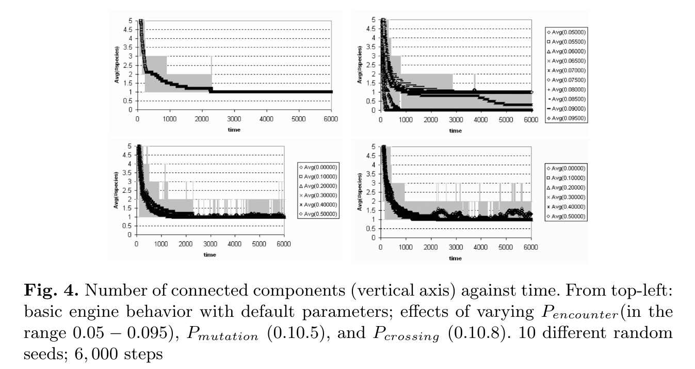|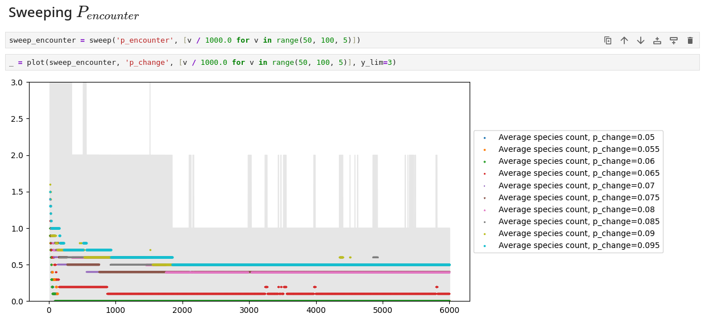|
||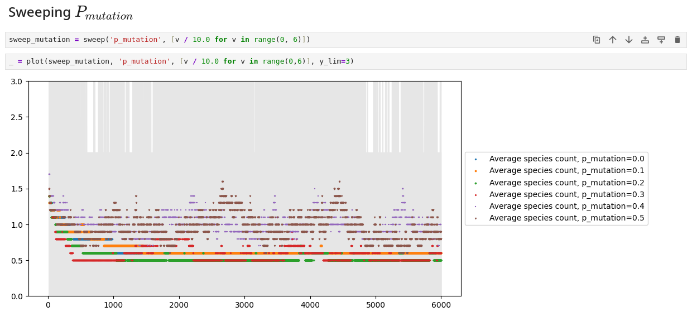|
||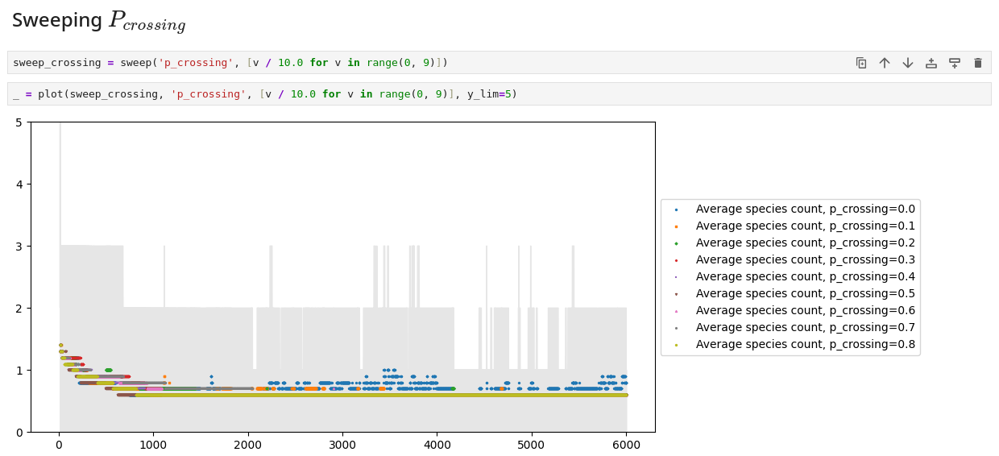|
|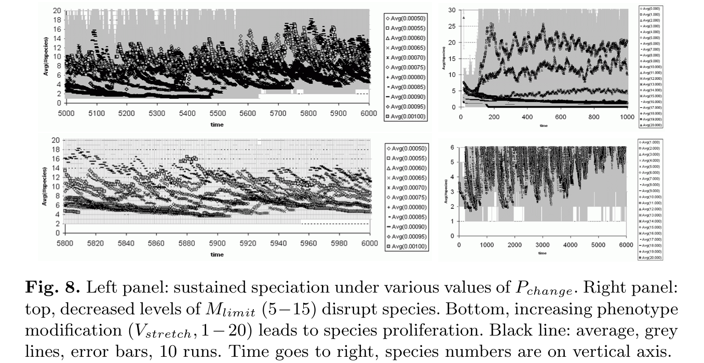|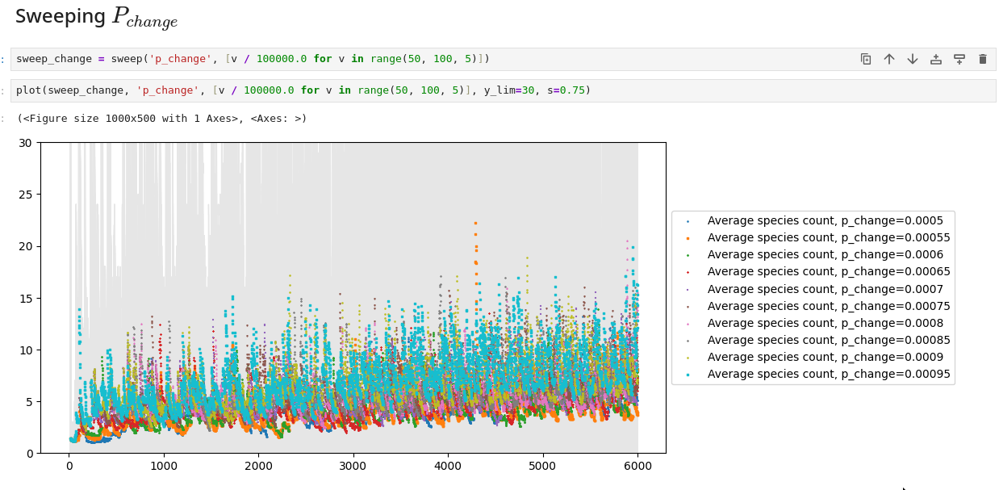|
||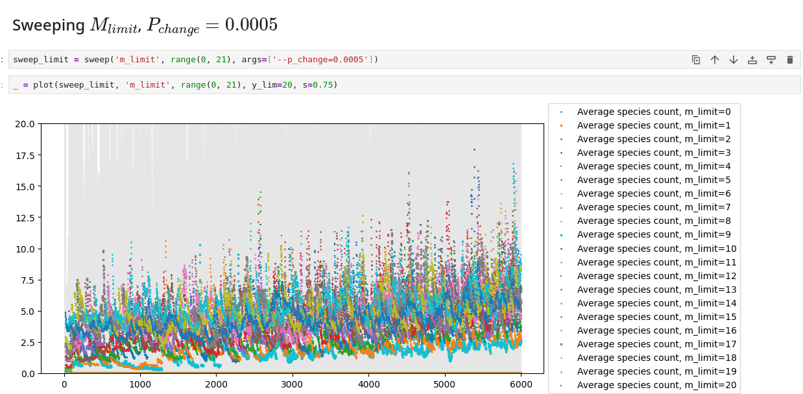|
||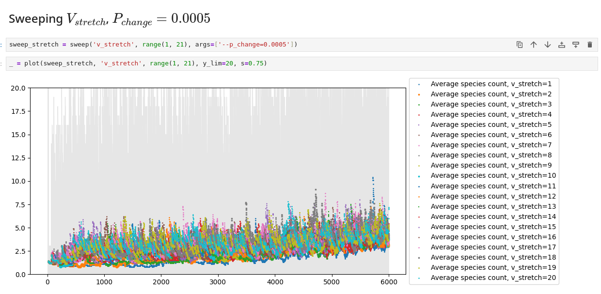|

## Usage

### NETLOGO implementation

1. Install NetLogo 6 or newer
2. Launch NetLogo and select `File` > `Open...`
   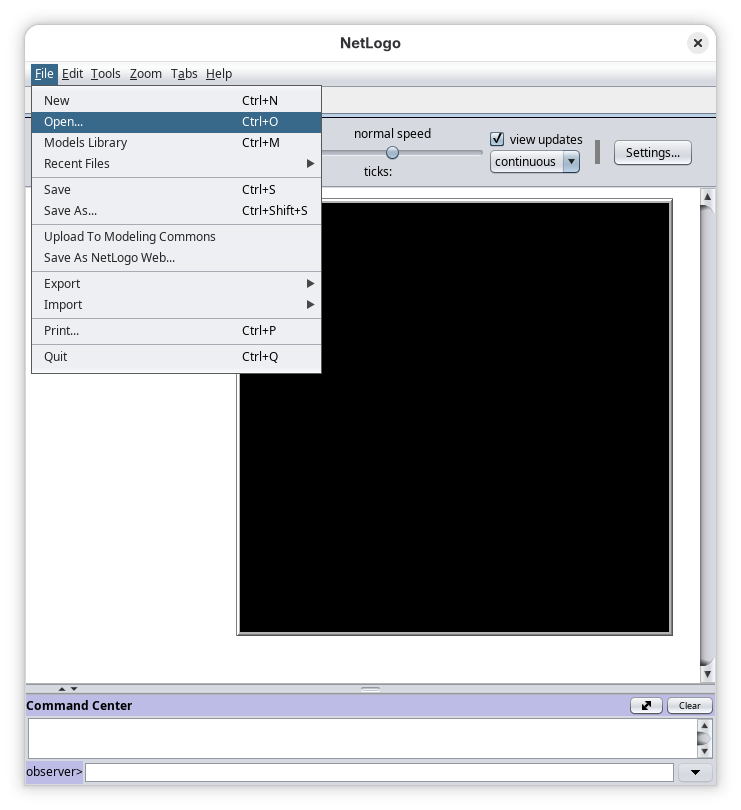
3. Browse to and select `model.nlogo`
4. Set the simulation parameters then click `setup`
   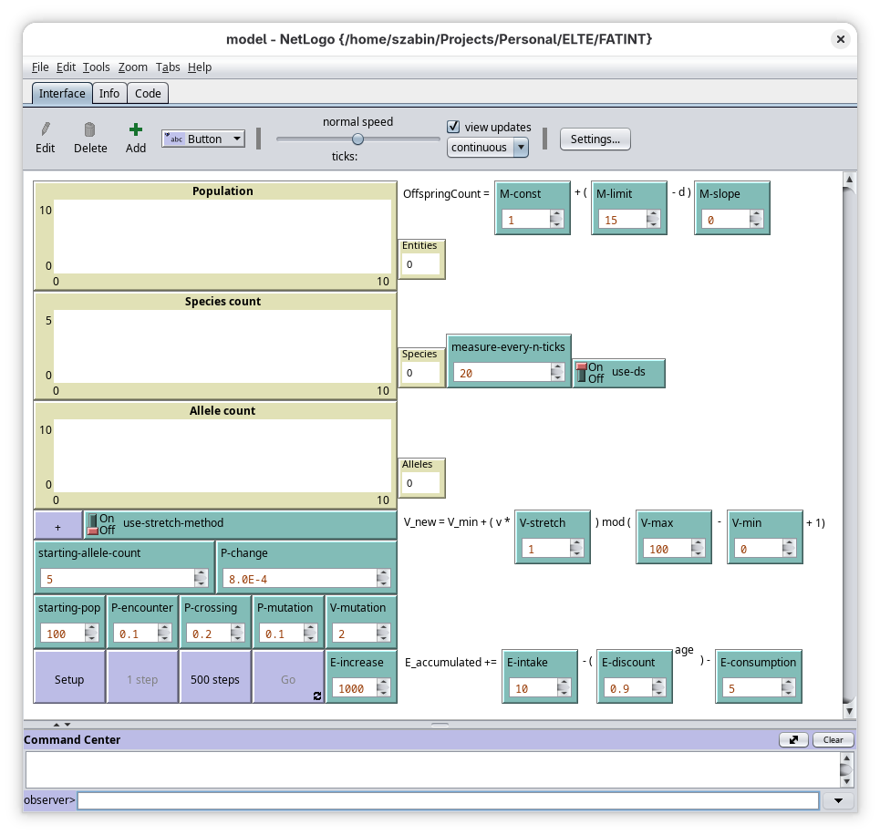
5. Click either `1 step`, `500 steps` or `Go`

To run multiple runs in parallel:

1. Open `model.logo` as above
2. Select `Tools` > `BahaviorSpace`
   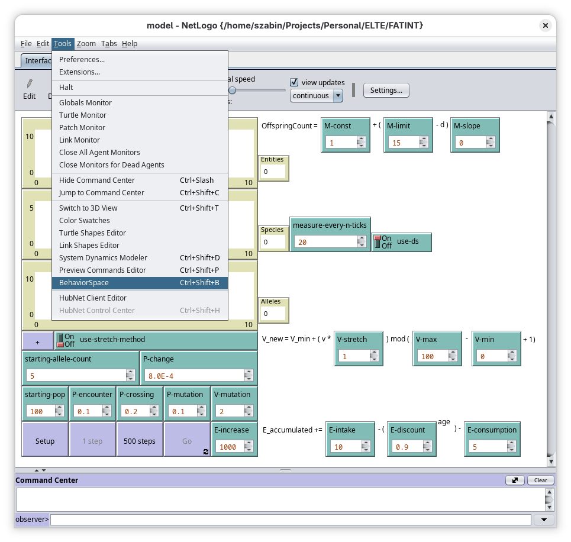
3. Select an experiment.
   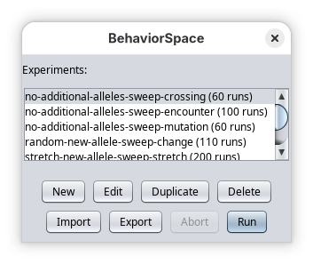
4. Optional, recommended: click `Edit` to set parameters.
   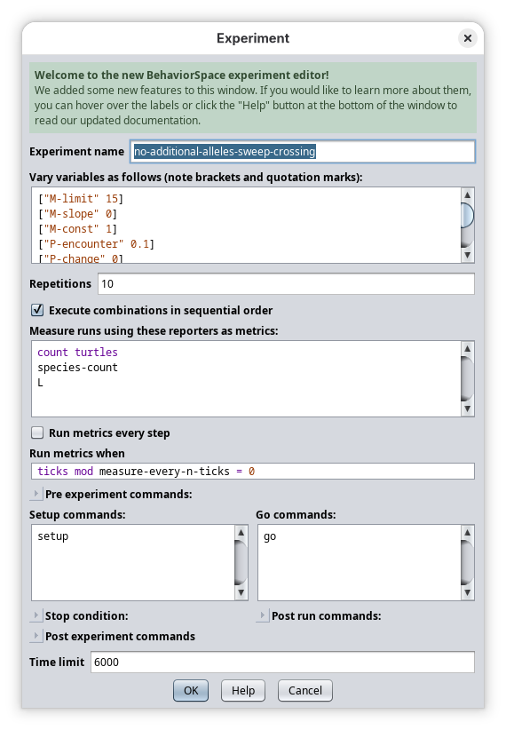
5. Click `Run`
6. Set the output file locations
   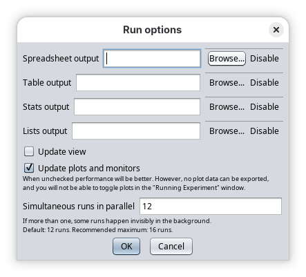
7. Optional, recommended: unselect `Update View` and `Update plots`
8. Click `OK`
   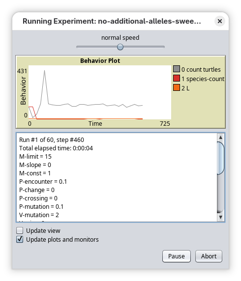

### C++ implementation

```
Usage:
  ./build/fatint [OPTION...]

  -r, --runs arg                Number of runs
                                (default: 10)

  -s, --steps arg               Number of iterations
                                (default: 6000)

  -S, --seed arg                Random seed of first run
                                Parallel runs' seeds are offset relative to first
                                (default: 1)

  -p, --starting_population arg
                                Initial population size
                                (default: 100)

  -g, --starting_gene_count arg
                                Initial number of genes
                                (default: 5)

      --p_encounter arg         Probability of reproduction attempt
                                (default: 0.1)

      --p_change arg            Probability of new gene per successful reproduction
                                (default: 0.0)

      --p_crossing arg          Probability of crossover per gene
                                (default: 0.2)

      --p_mutation arg          Probability of mutation per gene
                                (default: 0.1)

      --v_min arg               Minimum allele value
                                (default: 0)

      --v_max arg               Maximum allele value
                                (default: 100)

      --v_mutation arg          Maximum allele mutation ±
                                (default: 2)

      --v_stretch arg           Stretch factor when introducing new gene
                                (0 = generate random gene)
                                (default: 0.0)

      --m_const arg             Minimum number of offsprings per reproduction
                                (default: 1)

      --m_limit arg             Maximum number of offsprings per reproduction
                                (default: 15)

      --m_slope arg             How much should similarity affect offspring
                                count (default: 0.0)

      --e_increase arg          Amount of energy the environment
                                replenishes after each iteration
                                (default: 1000.0)

      --e_consumption arg       Energy consumption per iteration
                                (default: 5.0)

      --e_intake arg            Energy intake per iteration
                                (default: 10.0)

      --e_discount arg          Energy discount per age
                                (default: 0.9)

  -h, --help                    Print help
```

The results are output to STDOUT in CSV format, one row per simulation step.
Columns include the gene count, population and species count of each run,
as well as their averages and standard error.

A Jupyter notebook is included in the `notebooks` directory, which configures
the C++ implementation with the same parameters as the FATINT paper, and plots
the outputs.
